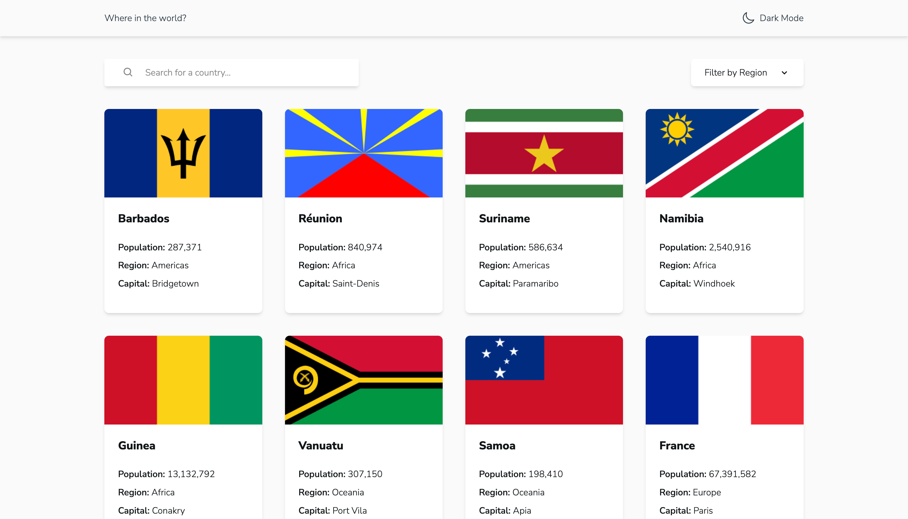

# Frontend Mentor - REST Countries API with color theme switcher solution

This is a solution to the [REST Countries API with color theme switcher challenge on Frontend Mentor](https://www.frontendmentor.io/challenges/rest-countries-api-with-color-theme-switcher-5cacc469fec04111f7b848ca). Frontend Mentor challenges help you improve your coding skills by building realistic projects.

## Table of contents

- [Overview](#overview)
  - [The challenge](#the-challenge)
  - [Screenshot](#screenshot)
  - [Links](#links)
- [My process](#my-process)
  - [Built with](#built-with)
  - [Useful resources](#useful-resources)
- [Author](#author)

## Overview

### The challenge

Users should be able to:

- See all countries from the API on the homepage
- Search for a country using an `input` field
- Filter countries by region
- Click on a country to see more detailed information on a separate page
- Click through to the border countries on the detail page
- Toggle the color scheme between light and dark mode

### Screenshot

### Links

- [Soultion](https://your-solution-url.com)
- [Live Site](https://garcia-jr-rest-countries-api.netlify.app/)

## My process

### Built with

- Semantic HTML5 markup
- Flexbox
- CSS Grid
- Mobile-first workflow
- [Vite](https://vitejs.dev/)
- [React Router](https://reactrouter.com/en/main)
- [TailwindCSS](https://tailwindcss.com/)

### Useful resources

- [Web Dev Simplified](https://www.youtube.com/watch?v=E1cklb4aeXA) - This video helped me create a searchbar for filtering through the countries.

## Author

- Frontend Mentor - [@Garcia-Jr](https://www.frontendmentor.io/profile/Garcia-Jr)
